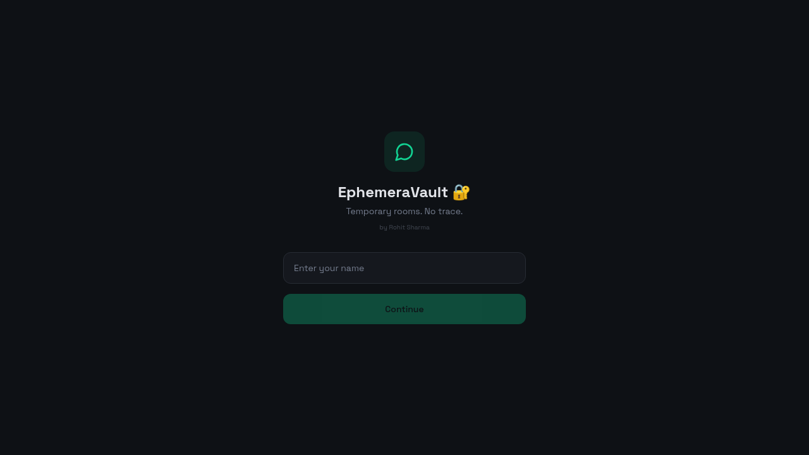
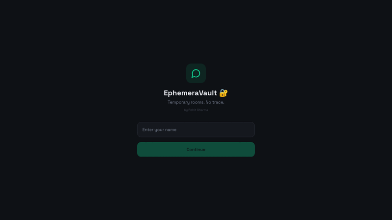

# EphemeraVault 🔐

> Temporary private chat rooms. **No accounts. No history. No trace.**

<p align="center">
  
</p>

<p align="center">
  
</p>

EphemeraVault is a minimalist, anonymous group chat app. Drop a name, spin up a
room, share the 6-character code with whoever you want, and start talking.
The moment the last person leaves, the room and every message in it are gone
forever.

## ✨ Features

- 🕶️ **Zero sign-up** — just type a display name and you're in.
- 🔑 **Room codes** — share a 6-char code; anyone with it can join, no one else can list it.
- 💬 **Real-time messaging** — powered by Supabase Realtime, with optimistic UI for instant feedback.
- ⌨️ **Typing indicators** — see when someone in the room is typing.
- 👥 **Live member count** — know who's around without a heavy presence panel.
- 🧹 **Self-destructing rooms** — when the last member leaves, the room and all its messages are auto-deleted via a server-side function.
- 🌑 **Dark, distraction-free UI** — built with Tailwind + shadcn/ui semantic tokens.

## 🧱 Tech stack

- **Frontend:** React 18, Vite, TypeScript, Tailwind CSS, shadcn/ui
- **Backend:** Lovable Cloud (Supabase) — Postgres, Row Level Security, Realtime, RPCs
- **Routing:** React Router
- **State:** React Context + Supabase Realtime channels

## 🗂️ Project structure

```
src/
├── components/        # ChatBubble, MessageInput, TypingIndicator, NavLink, ui/
├── context/
│   └── ChatContext.tsx   # Rooms, messages, members, typing, realtime sync
├── pages/
│   ├── WelcomePage.tsx   # Enter name
│   ├── LobbyPage.tsx     # Create or join a room
│   ├── ChatPage.tsx      # The chat itself
│   └── NotFound.tsx
└── integrations/supabase/  # Auto-generated client + types
```

## 🚀 Run locally

```sh
git clone <your-fork-url>
cd ephemeravault
npm install
npm run dev
```

Then open http://localhost:8080.

> The `.env` file ships with **publishable anon keys** — these are designed to
> live in client bundles and are safe to commit. See [`SECURITY.md`](./SECURITY.md)
> for the full threat model.

## 🔒 Security

This repo is intentionally public. Read [`SECURITY.md`](./SECURITY.md) for:

- Why the anon key in `.env` is safe to commit
- The exact RLS policies protecting the database
- The two security-definer RPCs (`get_room_by_code`, `leave_room`) that gate access
- Known residual risks of an unauthenticated chat app

## 🤝 Contributing

PRs welcome — fork, branch, and open a pull request.

---

Made with ☕ and 🔐 by rohit357
